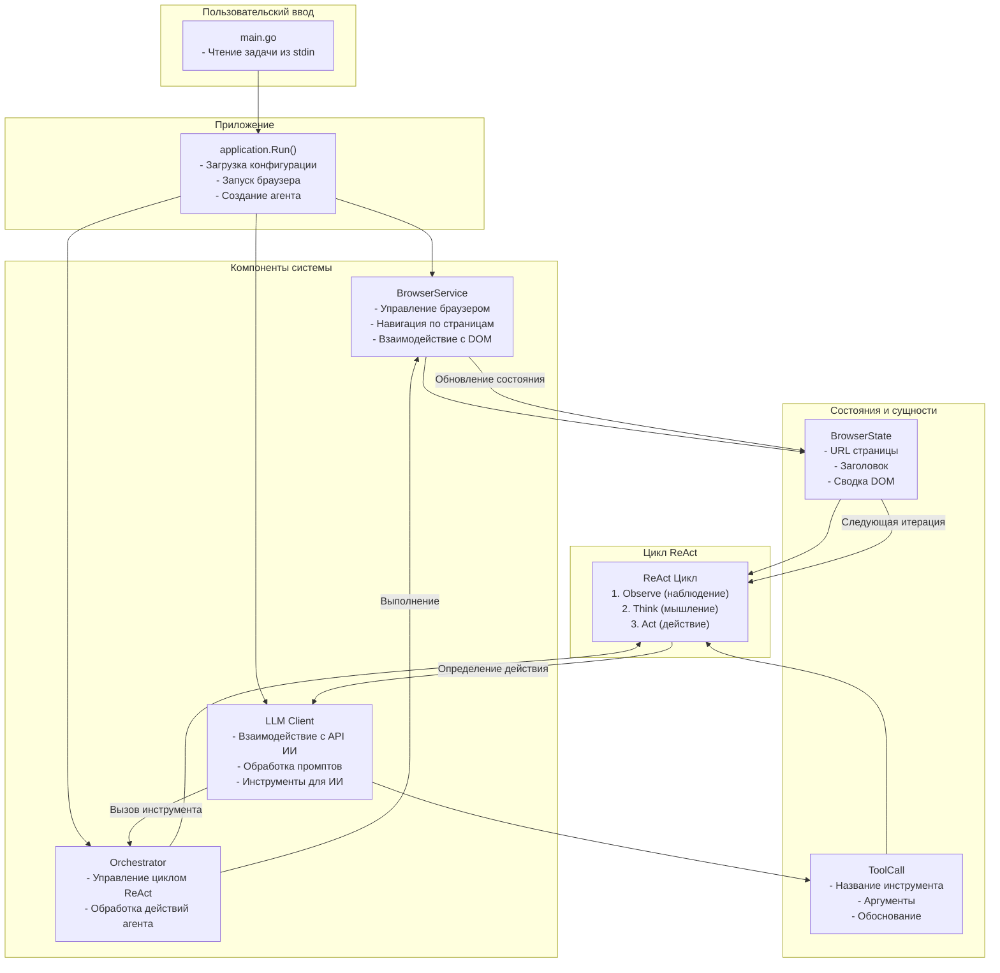

# Архитектура Browser Agent

## Общее описание

Browser Agent - это Go-приложение, которое использует библиотеку go-rod для автоматизации браузера. Приложение реализует агентную архитектуру, где ИИ (LLM) принимает решения о действиях, которые нужно выполнить на веб-странице.

## Диаграмма архитектуры



## Подробное описание компонентов

### 1. Application Layer (main.go и application.go)
- **main.go**: Точка входа в приложение. Создает контекст и запускает функцию `application.Run()`.
- **application.go**: Основная логика приложения:
  - Загружает конфигурацию из .env файла
  - Запускает браузер (с возможностью headless режима)
  - Создает экземпляр LLM клиента
  - Создает оркестратор (агент)
  - В бесконечном цикле читает задачи пользователя и передает их агенту

### 2. Browser Service (internal/browser/service.go)
- **BrowserService**: Основная структура, управляющая браузером:
  - Хранит подключение к браузеру
  - Текущую активную страницу
  - Карту элементов (ID -> элемент)
- **Функции**:
  - `NewBrowserService()`: Создает новый экземпляр службы браузера
  - `Navigate()`: Переходит по указанному URL
  - `GetCurrentPageInfo()`: Получает информацию о текущей странице
  - `Close()`: Закрывает браузер

### 3. Agent (internal/agent/core.go)
- **Orchestrator**: Главный компонент агента:
  - Связывает браузер и ИИ
  - Реализует цикл ReAct (Observe, Think, Act)
  - Управляет выполнением задач
- **Цикл ReAct**:
  - **Observe**: Получает текущее состояние браузера
  - **Think**: Отправляет состояние и задачу ИИ для получения следующего действия
  - **Act**: Выполняет полученное от ИИ действие

### 4. LLM Client (internal/llm/)
- **Client**: Взаимодействует с API ИИ:
  - Отправляет промпты
  - Обрабатывает ответы
  - Хранит историю действий
- **Actor**: Основная логика взаимодействия с ИИ:
  - Формирует сообщения для ИИ
  - Обрабатывает ответы
  - Повторяет запросы при ошибках
- **Tools**: Определяет доступные инструменты для ИИ:
  - click: Клик по элементу
  - type_text: Ввод текста в поле
  - press_enter: Нажатие клавиши Enter
  - scroll_down: Прокрутка вниз
  - go_to_url: Переход по URL
  - done: Завершение задачи
  - ask_user: Запрос информации у пользователя

### 5. Entities (internal/entity/)
- **BrowserState**: Состояние браузера:
  - URL текущей страницы
  - Заголовок страницы
  - Сводка DOM
- **ToolCall**: Вызов инструмента:
  - Название инструмента
  - Аргументы
  - Обоснование выбора действия
- **ActionRecord**: Запись о выполненном действии:
  - Обоснование
  - Название действия
  - Аргументы
  - Результат
- **AgentPlan**: План агента:
  - Подзадачи
  - Статус выполнения

### 6. Configuration (internal/config/config.go)
- **Config**: Структура конфигурации:
  - API Key
  - Модель ИИ
  - URL API
- **LoadConfig**: Загружает конфигурацию из .env файла или переменных окружения

## Процесс выполнения задачи

1. **Инициализация**:
   - Приложение запускается
   - Загружается конфигурация
   - Запускается браузер
   - Создаются экземпляры LLM клиента и оркестратора

2. **Цикл обработки задач**:
   - Пользователь вводит задачу
   - Задача передается оркестратору
   - Запускается цикл ReAct

3. **Цикл ReAct**:
   - **Observe**: Получение текущего состояния браузера (URL, заголовок, DOM)
   - **Think**: Отправка состояния и задачи ИИ для получения следующего действия
   - **Act**: Выполнение действия (клик, ввод текста, навигация и т.д.)

4. **Выполнение действия**:
   - Оркестратор интерпретирует ответ ИИ
   - Вызывает соответствующую функцию в BrowserService
   - Обновляет состояние браузера

5. **Повторение**:
   - Цикл продолжается до тех пор, пока ИИ не решит, что задача выполнена
   - ИЛИ пока не будет достигнут лимит шагов (защита от бесконечного цикла)

## Формирование DOM Summary

Browser Agent использует сложный JavaScript-скрипт для анализа DOM и создания упрощенного представления страницы. Вот как это работает:

### 1. JavaScript-скрипт `ObserveElementsScript`
- Скрипт анализирует страницу и находит все интерактивные элементы (кнопки, ссылки, поля ввода и т.д.)
- Также находит важные текстовые элементы (заголовки, параграфы)
- Присваивает каждому элементу уникальный ID
- Создает визуальные метки на странице для отображения ID элементов
- Возвращает JSON-объект с информацией об элементах

### 2. Пример DOM Summary
При выполнении задачи, агент может получить такой DOM Summary:

```
Visible Content:
[1] <h1> Welcome to Example Site </h1>
[2] <p> This is a sample paragraph with information. </p>
[3] <input type='text'> [SEARCH INPUT]
[4] <button> Search </button>
[5] <a> About Us </a>
[6] <button> {✓ CHECKED} Submit </button>
[7] <input type='checkbox'> ☐ unchecked
[8] <div> {★ ACTIVE} Featured Item </div>
```

### 3. Фильтрация элементов
Скрипт отфильтровывает:
- Мелкие невидимые элементы
- Элементы вне области просмотра
- Элементы в футере
- SVG и другие служебные теги
- Повторяющийся текст

### 4. Состояния элементов
Скрипт также определяет состояния элементов:
- `✓ CHECKED` / `☐ unchecked` для чекбоксов
- `★ SELECTED` для выбранных элементов
- `▼ expanded` / `▶ collapsed` для аккордеонов
- `DISABLED` для неактивных элементов
- `→ FOCUSED` для элементов с фокусом

## Примеры промптов, отправляемых LLM

### 1. Системный промпт (`ActorPrompt`)
```
Ты — браузерный агент. Выполняй задачу пользователя, взаимодействуя с веб-страницей.

## ДОСТУПНЫЕ ДЕЙСТВИЯ
| Tool | Когда использовать |
|------|-------------------|
| click(id) | Кнопки, ссылки, элементы меню |
| type(id, text) | Ввод в поля. После поиска — добавь press_enter=true |
| press_key(key) | enter=отправить, escape=закрыть попап |
| scroll(direction) | Элемент не виден — прокрути down/up |
| navigate(url) | Перейти на другой сайт |
| go_back() | Вернуться на предыдущую страницу |
| done(result) | ⚠️ ТОЛЬКО когда ВСЯ задача выполнена! |
| ask_user(question) | Перед удалением/оплатой/отправкой |

## АЛГОРИТМ
1. Прочитай TASK — это твоя цель
2. Посмотри HISTORY — не повторяй неудачные действия
3. Найди в DOM элемент с нужным ID (число в начале строки)
4. Вызови ОДИН tool

## ПРАВИЛА
- ID — это число из DOM (например: "42: <button>Купить</button>" → id=42)
- После type в поисковое поле — ВСЕГДА press_key("enter") или press_enter=true
- done — ТОЛЬКО когда цель ПОЛНОСТЬЮ достигнута
- Если элемента нет в DOM — scroll("down")

## ПРИМЕР
TASK: Найди цену iPhone 15 на Яндекс Маркете
DOM:
  12: <input placeholder="Искать товары">
  13: <button>Найти</button>

→ Вызываю: type(id=12, text="iPhone 15", press_enter=true)
→ Reasoning: "Ввожу запрос в поиск и отправляю"

[после загрузки результатов]
DOM:
  45: <span class="price">89 990 ₽</span>
  46: <a>iPhone 15 128GB</a>

→ Вызываю: done(result="iPhone 15 на Яндекс Маркете стоит 89 990 ₽")
→ Reasoning: "Цена найдена, задача выполнена"
```

### 2. Промпт пользователя (buildUserMessage)
Этот промпт формируется динамически и включает:

#### Задача пользователя:
```
# TASK
Найди мне кроссовки Nike Air Max по цене от 10000 до 15000 рублей
```

#### История действий:
```
# HISTORY (ANALYZE CAREFULLY)
1. Ввожу запрос в поиск и отправляю: type_text(id=12, text="Nike Air Max") → Typed 'Nike Air Max' into element 12
2. Нажимаю Enter для поиска: press_enter() → Pressed Enter
3. Устанавливаю фильтр по цене: type_text(id=25, text="10000") → Typed '10000' into element 25 ⚠️ REPEATED - TRY DIFFERENT APPROACH
```

#### Текущая страница:
```
# CURRENT PAGE
URL: https://www.example-store.com/search
Title: Поиск товаров - Example Store

## DOM
Visible Content:
[1] <h1> Результаты поиска: Nike Air Max </h1>
[12] <input type='text'> [MIN PRICE INPUT]
[13] <input type='text'> [MAX PRICE INPUT]
[14] <button> Применить фильтр </button>
[15] <a> Nike Air Max 90 </a>
[16] <span class="price"> 12 990 руб. </span>
[17] <button> В корзину </button>
[18] <a> Nike Air Max 270 </a>
[19] <span class="price"> 14 500 руб. </span>
[20] <button> В корзину </button>
```

## Особенности реализации

- **Защита от зацикливания**: Оркестратор отслеживает повторяющиеся действия и предотвращает зацикливание
- **Обработка ошибок**: Реализованы механизмы повторных попыток при ошибках API
- **Stealth режим**: Используется для обхода детектирования бота
- **Управление сессией**: Используется persistent session с сохранением данных в user_data
- **Асинхронность**: Использование контекстов для управления временем выполнения и отмены операций
- **Визуальная обратная связь**: Элементы подсвечиваются при клике и вводе текста
- **Определение состояний**: Скрипт определяет состояния элементов (checked, active, disabled и т.д.)

## Возможные улучшения

- Добавление поддержки дополнительных действий (скриншоты, выполнение JavaScript)
- Расширение инструментов для ИИ
- Улучшение обработки ошибок и восстановление после сбоев
- Добавление возможности работы с несколькими вкладками
- Улучшение логирования и мониторинга